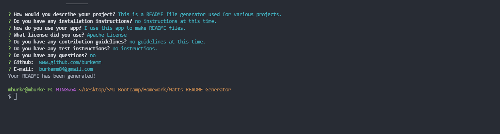

# Matts-README-Generator
#Table of Contents
* [Description](#description)
* [Installation](#installation)
* [Usage](#usage)
* [License](#license)
* [Contribution](#contribution)
* [Tests](#tests)
* [Questions](#questions)
## Description
This is a README file generator used for various projects. I learned how to create README generator in this exercise. This allwos me to have a README generator on all my work going forward now.
## Installation
no instructions at this time.
## Usage
I use this app to make README files.
## License
Apache License
## Contribution
no guidelines at this time.
## Tests

Direct link to video demo 
(https://drive.google.com/file/d/1TorKcJmc_ZOmJgRMqyFttcgM181SkIHN/view?usp=sharing)

Screenshot of Terminal 

GIF video of README Generator 

## Questions
'This is my contact information!'
* Github : www.github.com/burkemm
* E-mail : burkemm84@gmail.com